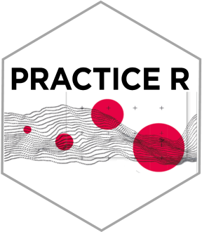
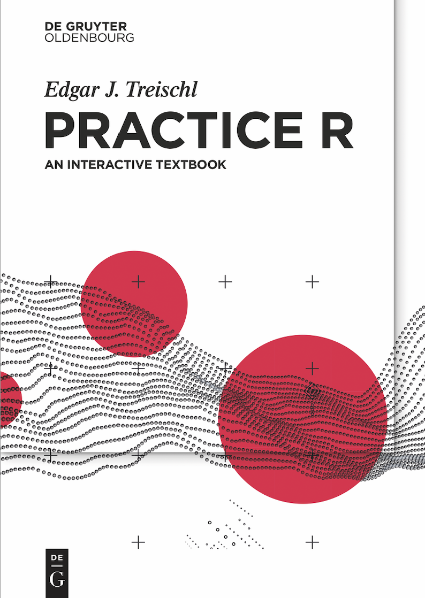

<!-- README.md is generated from README.Rmd. Please edit that file -->

```{r, include = FALSE}
knitr::opts_chunk$set(
  collapse = TRUE,
  comment = "#>",
  fig.path = "man/figures/",
  out.width = "100%"
)
```

# PracticeR 

<!-- badges: start -->

[](https://github.com/edgar-treischl/PracticeR/actions/workflows/R-CMD-check.yaml)

<!-- badges: end -->

Many students learn to analyze data using commercial packages, even though there is an open-source software with cutting-edge possibilities: R, a programming language with countless cool features for applied empirical research.

Practice R introduces R to social science students, inspiring them to consider R as an excellent choice. In a non-technical pragmatic way, this book covers all typical steps of applied empirical research. Learn how to prepare, analyze, and visualize data in R. Discover how to collect data, generate reports, or automate error-prone tasks.

The book is accompanied by an R package. This provides further learning materials that include interactive tutorials, challenging you with typical problems of applied research. This way, you can immediately practice the knowledge you have learned. The package also includes the source code of each chapter and templates that help to create reports. 

Practice R has social science students in mind, nonetheless a broader audience may use Practice R to become a proficient R user.

## Installation

You can install `PracticeR` from my GitHub account:

``` r
# install.packages("devtools")
devtools::install_github("edgar-treischl/PracticeR")
```

## Book Preview

```{css, echo=FALSE}
a.edgar {
  background-color: #C51717;
  color: white;
  padding: 1em 1.5em;
  text-decoration: none;
  text-transform: uppercase;
}

a.edgar:hover {
  background-color: #555;
}

a.edgar:active {
  background-color: black;
}

a.edgar:visited {
  background-color: #ccc;
}
```

<a href="https://www.amazon.de/Practice-Interactive-Textbook-Edgar-Treischl/dp/311070496X/ref=sr_1_2?__mk_de_DE=%C3%85M%C3%85%C5%BD%C3%95%C3%91&crid=1MY9JEP05K1OU&keywords=Practice+R&qid=1677311458&sprefix=practice+r%2Caps%2C102&sr=8-2"></a>


R is a programming language and a powerful tool to analyze data, but R has a lot more to offer than statistics. To mention just a few options, R has many capabilities to visualize data, to collect data (e.g., from a website), or even to create interactive dashboards. From this perspective it is no wonder why R has a huge fan base. Unfortunately, learning R can be though. People who struggle may say that the data handling is complicated, some complain that R lacks a graphical interface, and probably all agree that beginners face a rather steep learning curve. Regardless of our perception, the best way to learn R is by means of practice. For this reason, this book introduces R, focuses on the most important steps for applied empirical research, and explains how to use R in practice. After reading and working on the materials in this book, you will be able to *prepare* and *analyze* data, make *visualizations*, and *communicate* key research insights.

<br>
<a class="edgar" align="right" href="#">Download a reading sample (20/3/2023)</a>


