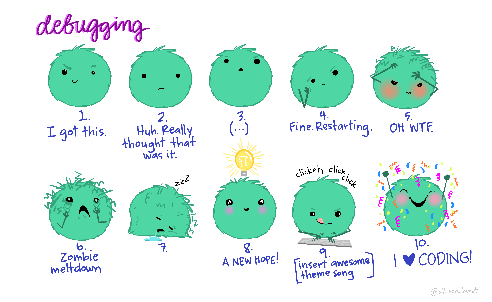

```{css, include=FALSE}
topicsFooter{
font-size: large; 
}

body {
  background-color: white;
  font-family: 'Source Sans Pro', sans-serif;
  font-size: 24;
}

```

```{r setup, include=FALSE}
library(learnr)
library(knitr)

knitr::opts_chunk$set(
  fig.width = 6,
  fig.height = 4,
  fig.path = "images/",
  echo = TRUE,
  warning = FALSE,
  message = FALSE,
  eval = TRUE,
  comment = "#>",
  error = TRUE
)

tutorial_options(exercise.lines = 5, 
                 exercise.eval=FALSE)

#english environment
Sys.setenv(LANG = "en")
knitr::opts_chunk$set(tidy = "styler")

```


## Base R <a href="https://www.r-project.org" target="_blank"></a>

Welcome to the `base` R tutorial (Chapter 2) of the [Practice R](https://www.degruyter.com/document/isbn/9783110704969/html?lang=de "Go to the website") book [@treischl_practice_2023]. Practice R is a text book for the social sciences and it provides several tutorials supporting students to learn R. Feel free to inspect the tutorials even if you are not familiar with the book, but keep in mind that tutorials are supposed to be accompanied by the Practice R book. 


In Chapter 2, I introduced R and we learned the basics about `base` R. However, `base` R has more to offer than I can possibly outline, but also much more than is necessary for your first steps with R. Consider how a `while()` loop works. A while loop repeats code until a certain condition is fulfilled. The next console shows the principle. The loop prints `i` and adds one to `i` until `i` is, for example, smaller than four. This example is extremely boring, but it illustrates the concept.


```{r r1, exercise=TRUE, exercise.lines = 9}
#Boring base R example
i <- 1

#while loop
while (i < 4) {
  print(i)
  i <- i + 1 
}
```

I will introduce further `base` R features when we need them and I will not ask you to assign objects, create simple functions, or other probably boring `base` R examples in this tutorial. Such tasks are important but abstract in the beginning. Instead, we focus on typical errors that may occur while we start work with R. Why do we not practice the discussed content of `base` R, but concentrate on errors in this tutorial?

To learn a new programming language is a demanding task. It does not even matter which programming language we talk about, there is an abundance of mistakes and errors (new) users face in the beginning. For this reason we will get in touch with typical errors messages from R. For example, sometimes an error occurs only because of a spelling mistake. Can you find the typo in the next console?

```{r r2, error=TRUE, exercise=TRUE}
#Fimd the typo
primt("Hello World")
```

```{r r2-hint, echo=FALSE, eval=FALSE}
#Ah c'mon, read my friend ;)
```

RStudio has a auto-completion function which helps us to avoid such syntax errors, but learning R implies that you will come across many and sometimes cryptic errors messages (and warnings). Errors and debugging is hard work as the artwork from Allison Horst clearly shows. Thus, as a new user you will run into many errors and the question is how we can manage the process of debugging.

```{r r3, eval=FALSE, echo=FALSE, eval=FALSE}
#hello
```

[{width="90%"}](https://allisonhorst.com/everything-else)


To support you in this process, we will reproduce errors in this tutorial. We try to understand what they mean and I ask you to fix them. We focus on typical errors that all new users face, explore cryptic errors you will come across in the near future, and further sources of errors. Finally, I summarize the introduced `base` R functions and I show you where to find more help in case you run into an error.

## Typical error messages

What kind of errors do we need to talk about? Sometimes we introduce errors if we are not cautious enough about the code. Spelling mistakes (e.g., typos, missing and wrong characters, etc.) are easy to fix but hard to find. For example, I tried to use the assignment operator, but something went wrong. Do you know what might be the problem?

```{r r4, error=TRUE, exercise=TRUE, exercise.blanks = "-<"}
#Assigning the values the wrong way
a -< 5
b -< 3

a + b
```

```{r r4-hint, echo=FALSE, eval=FALSE}
#Keep the short cut for the assignment operator in mind:
#<Alt/Option> + <->
```


Spelling mistakes are often hard to find, especially in your own code. There are certainly several reasons, but it is part of the human nature to complete text and the same applies to spelling mistakes that result in an error. This gives us the possibility to read fast, but it makes it difficult to see our own mistakes. Don't get frustrated, it happens even if you have a lot of experience working with R. Thus, check if there are no simple orthographically mistakes - such as typos, missing (extra) parentheses, and commas - which prevents the code from running.

I highlighted in Chapter 2 that RStudio inserts opening and closing parentheses, which reduces the chance that missing (or wrong) characters create an error, but there is no guarantee that we insert or delete one by chance. Suppose you try to estimate a mean in combination with the `round()` function. I put a parenthesis at a wrong place, which is why R throws an error. Can you see which parenthesis is causing the problem?

```{r r6, error=TRUE, exercise=TRUE, exercise.blanks = ")))"}
#Check parenthesis
round(mean(c(1, 4, 6))), digits = 2)
```

```{r r6-solution, echo=FALSE, eval=FALSE}
round(mean(c(1, 4, 6)), digits = 2)
```

This error is hard to spot, but it illustrates that we need to be careful not to introduce mistakes. Moreover, RStudio gives parentheses that belong together the same color which help us not to lose the overview. Go to the RStudio menu (via the `<Code>` tab) and select *rainbow parentheses* if they are not displayed in color in the Code pane. Rainbow parentheses help us to recognize parentheses that belong together.

Unfortunately, RStudio cannot help us all the time because some R errors messages (and warnings) are cryptic. There are even typical errors messages that are quite obscure for beginners. For example, R tells me all the time that it can't find a object, functions, and data. There are several explanations why R throws such an error. If R cannot find an object, check if the object is listed in the environment. If so, you know for sure that the object exists and that other reasons cause the error. R cannot find an object even in the case of a simple typo.

```{r r7, error=TRUE, exercise=TRUE}
#R cannot find an object due to typos
mean_a <- mean(1,2,3)
maen_a
```

R tells us that a function (an object) cannot be found if different notations are used. Keep in mind that R is case-sensitive (`r` vs. `R`) and cannot apply a function (or find an object) that does not exist, as the next console illustrates. Of course, the same applies if you forgot to execute the function before using it or if the function itself includes an error and cannot be executed. In all of these examples R cannot find the function (or object).

```{r r8, error=TRUE, exercise=TRUE, exercise.lines = 9}
#R is case-sensitive
return_fun <- function(x) {
  return(x)
}

Return_fun(c(1, 2, 3))
```

What is the typical reason why a function from an R package cannot be found? I started to introduce the `dplyr` package in Chapter 2 [@dplyr]. Suppose we want to use the `select` function from the package. To use anything from an R package, we need to load the package with the `library()` function each time we start (over). Otherwise, R cannot find the function.

```{r r9, error=TRUE, exercise=TRUE}
#Load the package to use a function from a package
library(palmerpenguins)
select(penguins, species)
```

The same applies to objects from a package (e.g., data). The `.packages()` function returns all loaded (attached) packages, but there is no need to keep that in mind. Go to the packages pane and check if a package is installed and loaded. R tells us only that the function cannot be found if we forget to load it first.

```{r r10, exercise=TRUE}
#Inspect the loaded packages via the Packages pane
loaded_packages <- .packages()
loaded_packages
```

Ultimately, suppose we try to import data. Never mind about the code, we focus on this step in Chapter 5 in detail, but R tells us that it *cannot open the connection* if the file cannot be found in the current working directory.

```{r r11, warning=TRUE, error=TRUE}
#Load my mydata
read.csv("mydata.csv")
```

R tells that data or other files cannot be found because we provided the wrong path to the file. We will learn how to import data later, but keep in mind that R cannot open a file if we search in the wrong place. In Chapter 2, I outlined many possibilities to change the work directory with RStudio in convenient ways. In addition, the `getwd()` function returns the current work directory in case of any doubts.

```{r r12, eval=FALSE}
#Do we search for files in the right place
getwd()
#> [1] "C:/Users/Edgar/R/Practice_R/Tutorial/02"
```

```{=tex}
\begin{verbatim}
#> [1] "C:/Users/Edgar/R/Practice_R/Tutorial/02"
\end{verbatim} 
```
Loading the right packages and searching in the right place does not imply that we do not introduce mistakes by chance. Suppose you want to apply the `filter` function from the `dplyr` package. You copy and adjust the code from an old script, but R returns an error. Can you see where I made the mistake? I tried to create a subset with `Adelie` penguins only, but `dplyr` seems to know what might be the problem. 

```{r r13, error=TRUE, exercise=TRUE}
#Mistakes happen all the time ...
library(dplyr)
filter(penguins, species = "Adelie")
```

```{r r13-solution, echo=FALSE, eval=FALSE}
filter(penguins, species == "Adelie")
```

Typos, missing functions (objects) and confusion about operators are typical mistakes and some packages return suggestions to fix the problem. Unfortunately, R comes with some cryptic error messages, which are often harder to understand.

## Cryptic errors

Not all error R messages and warnings are cryptic. Suppose you wanted to estimate a mean of an `income` variable. The variable is not measured numerically which implies that cannot estimate the mean. R warns us about wrong and inconsistent data types.

```{r, error=TRUE, warning=TRUE, results='hide'}
#Warning: argument is not numeric or logical
income <- c("More than 10000", "0 - 999", "2000 - 2999")
mean(income)
```

Unfortunately, some errors and warnings seem more like an enigma than useful feedback. Imagine, R tells you that a *non-numeric argument* has been applied to a *binary operator*. The next console reproduces the error with two example vectors. The last value of the vector `y` is a character (e.g., a missing value indicator: `NA`) and for obvious reasons we cannot multiply `x` with `y` as long as we do clean the latter.

```{r r14, error=TRUE, exercise=TRUE}
#Cryptic error: A non-numeric argument to binary operator
x <- c(3, 5, 3)
y <- c(1, 4, "NA")

result <- x * y
result
```


We will learn how to fix such problem in a systematic manner later, just keep in mind that such an error message might be due to messy, not yet prepared data. Or suppose you tried to estimate the sum but R tells you that the code includes an *unexpected numeric constant*. Any idea what that means and how to fix the example code of the next console?

```{r r15, error=TRUE, exercise=TRUE}
#Cryptic error: Unexpected numeric constant
sum(c(3, 2 1))
```

```{r r15-solution, echo=FALSE, eval=FALSE}
sum(c(3, 2, 1))
```

R finds an unexpected numeric constant (here `1`) because I forgot the last comma inside the `c()` function. The same applies to strings and characters. R tells us that there is an unexpected *string constant*. Can you see where?

```{r r15a, error=TRUE, exercise=TRUE, exercise.blanks = "___"}
#Cryptic error: Unexpected string constant
names <- c("Tom", "Diana"___"Pete")
names
```

```{r r15a-solution, echo=FALSE, eval=FALSE}
names <- c("Tom", "Diana", "Pete")
names
```

Or consider *unexpected symbols*. Can you find the problem of the next console. I used to `round` function but something went wrong with the `digits` option.

```{r r16, error=TRUE, exercise=TRUE}
#Cryptic error: Unexpected symbol
x <- mean(c(1:3))
round(x digits = 2)
```

```{r r16-solution, echo=FALSE, eval=FALSE}
x <- mean(c(1:3))
round(x, digits = 2)
```

Thus, we introduce a mistake with a function argument since the comma is missing. A similar mistake happens if we forget to provide a necessary or provide a wrong argument. For example, there is no `numbers` option of the `round` function as the next console (and the help files `?round`) outline.

```{r r17, error=TRUE, exercise=TRUE}
#Cryptic error: Unused argument
x <- mean(c(1:3))
round(x, numbers = 2)
```

```{r r17-hint, echo=FALSE, eval=FALSE}
#digits!!!!!!
```


Try to be patient and kind to yourself if you run in such an error. You will become better to solve errors, but they will happen all the time. Let me give you one more for the road. Consider the error message: *object of type 'closure' is not subsettable*. R returns this error message if we try to slice a variable that does not exist or if we try to slice a function instead of providing a column vector. Can you fix the next console and provide a column vectors instead of slicing the `mean()` function.

```{r r18, warning=TRUE, error=TRUE, exercise=TRUE}
#Cryptic error: Object of type 'closure' is not subsettable
mean[1:5]
```

```{r r18-hint, echo=FALSE, eval=FALSE}
#Use () instead of []
```

## Further sources of errors

There are further errors and mistakes and this tutorial cannot capture all of them, but at least I give you a heads-up that it takes time and experience to overcome such problems. For example, consider one more time the small data that we used to slice data in Practice R.

```{r r19, error=TRUE, exercise=TRUE, exercise.lines = 9}
#Save data as df
df <- tibble::tribble(
    ~names, ~year,     ~sex,
   "Bruno",  1985,   "male",
  "Justin",  1994,   "male",
   "Miley",  1992, "female",
  "Ariana",  1993, "female"
  )
```

Do you still remember how to slice the data? Give it a try with the following examples:

```{r r20, exercise=TRUE, exercise.setup = "r19"}
#Slice the first column (variable)
```

```{r r20-solution, echo=FALSE, eval=FALSE}
df[1]
```

```{r r21, exercise=TRUE, exercise.setup = "r19"}
#First row
```

```{r r21-solution, echo=FALSE, eval=FALSE}
df[1, ]
```

Suppose you have not worked with R for a few weeks, can you still remember how slicing works? We all face the same problems when we start to learn something new and you may need several attempts to get the desired information. However, you may not even need to think about how it works if you have sliced data many times. Thus, be patient and kind to yourself, because some concepts need time and experience to internalize them.

Moreover, there are often several approaches to reach the same goal and - depending on your preferred style - some are harder or easier to apply. Say you need the `names` of the stars as a column vector. Can you slice the data or use the `$` operator to get the `names` variable from the data frame?

```{r r22, exercise=TRUE, exercise.setup = "r19"}
#Slice or use the the $ operator
```

```{r r22-solution, echo=FALSE, eval=FALSE}
names <- df$names
names <- df[1]
names
```

Unfortunately, some mistakes are logical in nature and pure practice cannot help us to overcome such problems. Consider the next console. I created a slice function (`slice_function`) which is supposed to return an element of a vector `x`, but so far it only returns non-sense. Why does it not return the second element of the input data?

```{r r23, exercise=TRUE, exercise.lines = 9}
#A pretty messed up slice_function
data <- c(3, 9, 1, 5, 8, "999", 1)

slice_function<- function(data, x){
  data[x]
}

slice_function(2)
```


```{r r23-solution, echo=FALSE, eval=FALSE}
data <- c(3, 9, 1, 5, 8, 1)

slice_function<- function(data, x){
  data[x]
}

slice_function(data, x = 2)
```

In the near future, your code will encompass several steps, try to break it into its single elements and examine each step separately. For example, inspect the vector `x` to see if error was introduced in the first step. Use the `class()` function to examine if the input of a variable is as expected (e.g. numerical). If we are sure about the input, we would go on to the next step and so on. Certainly, the last example is not complicated but the complexity of code (and the tasks) will increase from the chapter to chapter. By breaking down all steps into elements, you may realize where the error occurs and how to fix it.

## Summary

All tutorials of Practice R will end with a short code summary of the corresponding book chapter. The summary only contains the function name from the R help file and code example of the most important functions and packages. With regard to Chapter 2, keep the following functions in mind:

- Install packages from repositories or local files (install.packages)
- Loading/attaching and listing of packages (library)
- Inspect the help file (?function)
- Combine values into a vector or list (c)
- Compare objects (<=, >=, ==, !=)
- Replicate elements of vectors and lists (rep)
- Sequence generation (seq)
- Sum of vector elements (sum)
- Length of an object (length)
- Object classes (class)
- Data frames (data.frame)
- Build a data frame (tibble::tibble, Müller and Wickham 2022)
- Row-wise tibble creation(tibble::tribble)
- The number of rows/columns of an array (nrow/ncol)

`Base` R and many R packages have cheat sheets that summarize the most important features. You can inspect them directly from RStudio (via the `<help>` tab) and I included the link to the `base` R cheat sheet in the `PracticeR` package.

```{r r24, eval=FALSE, exercise=TRUE}
#Cheat sheets summarize the most important features
#The base R cheat sheet
PracticeR::show_link("base_r")
```

Finally, a link to download this tutorial as PDF file.

```{r, echo=FALSE, eval=T}
actionButton("download", "PR Tutorial 02", onclick="window.open('https://github.com/rstudio/cheatsheets/blob/main/base-r.pdf')", icon = icon("file-pdf"))
```


## References


