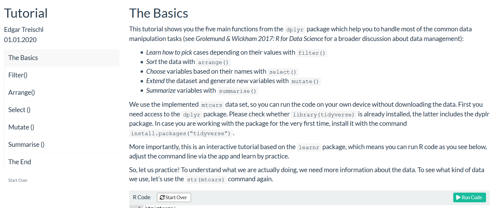

```{r, include = FALSE}
knitr::opts_chunk$set(
  collapse = TRUE,
  comment = "#>",
  fig.width = 7
)
```

The `PracticeR` package gives access to tutorials, templates, and further materials of the Practice R book. This page summarizes the main functions of the package.


First of all, it give access to source code of the book. The `show_script()` function returns the code for each chapter. It copies the code from GitHub, opens a new R script and inserts the code for a chapters. If no internet connection is available, it copies and paste the code from the installed version of the `PracticeR` package. Just insert one of the following script names.

```{r, error=TRUE}
library(PracticeR)
show_script()
```

The book is expected for 2023, at the moment there is only one `preview` tutorial available. To load a specific tutorial, use the Tutorial pane or insert the corresponding name in the `practice` function, which calls the `learnr` package in the background and hands over the tutorial from the `PracticeR` package.

```{r, eval=FALSE}
library(PracticeR)
## basic example code
practice("preview")
```

The tutorial should be opened in RStudio or your browser:




In addition, the package includes convenient functions to learn R. For example, the `show_linetypes` function returns the line types graph.

```{r}
show_linetypes()
```

The `show_shapetypes` function returns the shape types graph.

```{r}
show_shapetypes()
```

And the `transformer()` function transforms a numerical variable according to the ladder of powers and returns histograms to inspect the transformation.

```{r}
transformer(mtcars$mpg)
```

