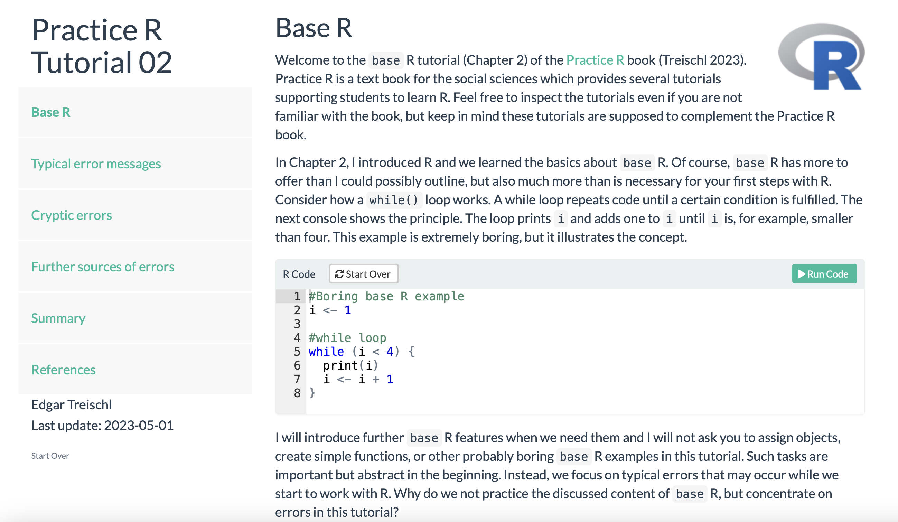

```{r, include = FALSE}
knitr::opts_chunk$set(
  collapse = TRUE,
  comment = "#>",
  fig.width = 7
)
```

The `PracticeR` package gives access to tutorials, templates, and further materials of the Practice R book. This page summarizes the main functions of the package.

```{r}
#Load package first
library(PracticeR)
```


## Get access to the source code of each chapter


The `show_script()` function returns the code for each chapter. It copies the most recent version of the code from my GitHub account, it opens a new R script and inserts the code of the chapter. It copies and paste the code from the installed version of the `PracticeR` package if no internet connection is available. Just insert one of the following chapter names, as the next console illustrates.

```{r, error=TRUE}
#Get source code via
show_script()
```

## Get access to the tutorials


The book is expected for 05/2023, at the moment there is only the `base` R tutorial available which corresponds with Chapter 2. To load a specific tutorial, go the Tutorial pane and start it from there. Alternatively, insert the corresponding name in the `show_tutorial()` function, which calls the `learnr` package in the background and hands over the tutorial from the `PracticeR` package. The tutorial should be opened in RStudio or your browser. A preview version is also online available.

```{r, eval=FALSE}
#Run tutorials via show_tutorial or from the tutorial pane
show_tutorial("02_base")
```


<a href="https://edgar-treischl.shinyapps.io/02_baseR/"></a>


## Further materials and functions

The package includes further convenient functions to learn R. For example, the `show_linetypes()` function returns a graph that show which line types exist in R.

```{r}
show_linetypes()
```

The `show_shapetypes()` function does the same with shape types.

```{r}
show_shapetypes()
```

And the `transformer()` function transforms a numerical variable according to the ladder of powers and returns histograms to inspect the transformation.

```{r}
transformer(mtcars$mpg)
```

